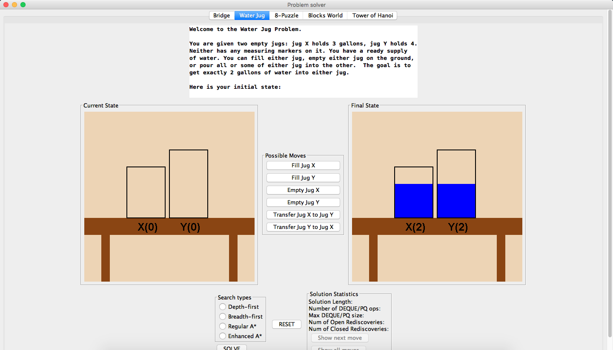
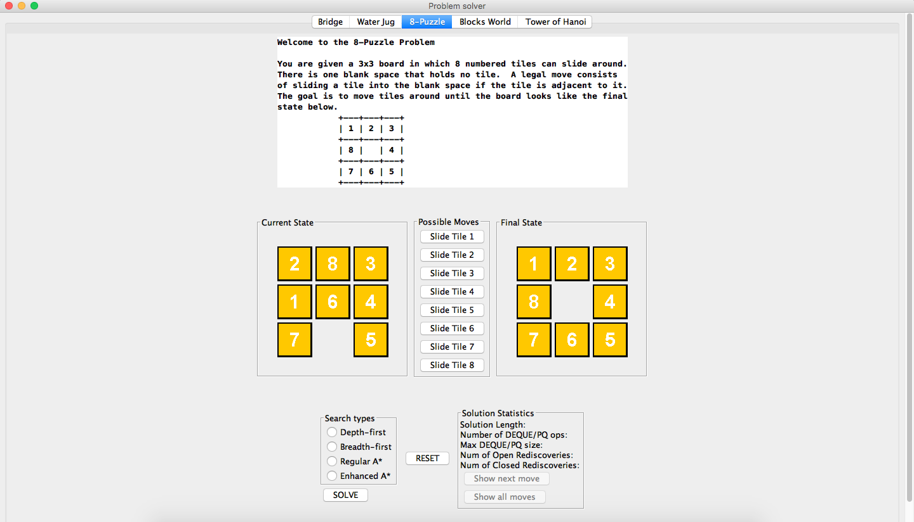
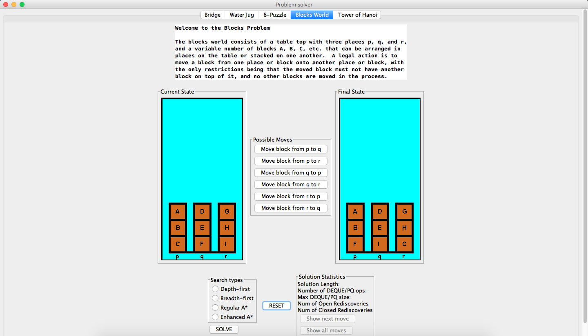
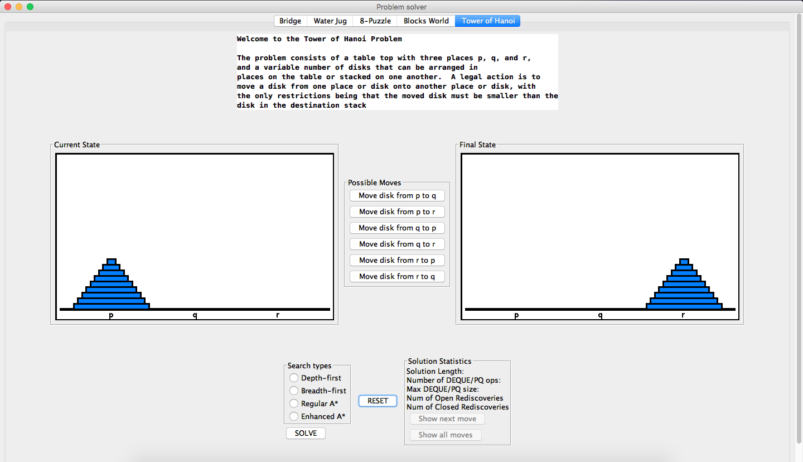

# Problem Solver

<a href="url"></a>
<a href="url"></a>
<a href="url"></a>
<a href="url"></a>

Class project from CS 2511: Software Analysis & Design. The program is wrritten in Java. It implements some graph search algorithms such as Depth First Search, Breadth First Search, and A* Search to solve some puzzles games such as 8-puzzle, blocks world, Hanoi tower, etc. To run the program, clone this project and open ```./dist/CS_2511_Framework.jar```
